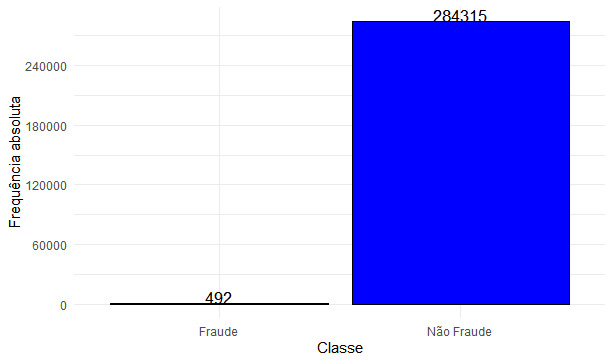

# Modelo de regressão logística para detecção de fraude com balanceamento dos dados

## Resumo
Os algoritmos de modelos estatísticos e aprendizado de máquina são técnicas utilizadas na detecção de fraudes em operações bancarias. Essas técnicas se utilizam de dados históricos das instituições financeiras para identificação de operações normais ou fraudulentas. Porém, geralmente, nas bases de fraude há o problema do alto desbalanceamento dos dados. Diante disso, utilizarei duas técnicas de balanceamento de dados, Oversampling e Undersampling, para detecção de operações fraudulentas com mais precisão. Após a utilização dessas técnicas, vou comparar os resultados obtidos via modelo de regressão logística binária dos dados desbalanceados e balanceados.
As análises e os modelos dos dados foram feitas no R, o script do trabalho estará salvo com script.r na pasta.

## Objetivo
Empregar técnicas de balanceamento de dados que consigam capturar da melhor forma as fraudes nas transações de cartão de crédito. Após a utilização dessas técnicas serão estimados modelos de regressão logística a partir de dados disponível no Kaggle das transações feitas em dois dias de setembro de 2013 com cartões de créditos europeus.
## Métodos

### Balanceamento dos dados

Um dos possíveis problemas na modelagem de transações de fraude é o desbalanceamento de dados, ou seja, as frequências das classes são discrepantes. Com isso, ao criar um modelo de detecção de fraude, o padrão da classe com maior frequência vai se sobressair ao de menor frequência. Para contornar este problema, se recorre aos métodos Undersampling e Oversampling que permitem equilibrar os dados da variável resposta. O método "Oversampling” é a adição no conjunto de dados de réplicas das observações da classe com menor frequência, de modo a corresponder ao número de amostras da classe majoritária. Enquanto o método de Oversampling aumenta o conjunto de dados repetindo as observações da classe minoritária, o método Undersampling pode ser definido como a remoção de algumas observações aleatoriamente da classe majoritária.

### Modelo de regressão logístico

A regressão de Regressão Logística Binária é uma técnica de modelagem supervisionada em que a variável dependente é binária, ou seja, assume apenas dois valores. O seu principal objetivo é a criação de um modelo para estudar a probabilidade de um evento ocorrer na variável resposta com base no comportamento das variáveis explicativas.

### Matriz de confusão

Em análise preditiva, mais especificamente, no problema de classificação, a matriz de confusão é uma tabela que permite a visualização do desempenho do modelo.
Com base na matriz de confusão, tem-se os seguintes critérios de avaliação de modelo:

**i) Acurácia**: Corresponde a porcentagem de acerto das observações classificadas em fraudes e não fraudes em relação ao total de transações.

**ii) Sensibilidade**: Corresponde ao percentual de acerto das observações classificadas como fraude em relação ao total de fraudes observadas.
 
 **iii) Precisão**: Corresponde ao percentual de acerto das observações classificadas como fraude em relação ao total de fraudes que foram classificados como fraude.
 
 **iv) F1-score**: É a média harmônica entre Sensibilidade e Precisão.

## Sobre os dados

A base de dados utilizada neste trabalho é uma base pública e está disponível no [Kaggle](https://www.kaggle.com/datasets/mlg-ulb/creditcardfraud). Esse conjunto de dados contém 285.299 transações feitas em dois dias de setembro de 2013 com cartões europeus. Ela contém 28 variáveis numéricas, que são resultados de uma transformação de Componente Principal (PCA), além das variáveis Time, "Amount" e Class. Por questão de confiabilidade não foram reveladas as variáveis que resultaram na transformação PCA das 28 variáveis, Time corresponde aos segundos decorridos entre cada transação e a primeira transação do conjunto de dados, Amount é o valor (em dólar) da transação e Class representa a variável resposta que assume o valor igual a 1 quando ocorre fraude e 0 para transações sem fraude.

## Análise de Dados

O gráfico da matriz de correlaçãoes mostra que as variáveis não apresentaram correlações fortes entre elas. A maior correlação da base de dados ocorre nas variáveis V2 e Amount, a correlação entre as duas variáveis é de 0,53, isso significa que essas variáveis são moderadamente correlacionadas negativamente. Entretanto, com a variável resposta só se encontra correlações fracas. A maior delas é 0,33, que é a correlação entre as variáveis class e V17.

 

A variável Time indica o número de segundos entre a transação atual e a primeira transação. Para melhorar e facilitar a visualização dos dados, foi feita uma transformação na forma de medida da variável, alterando os segundos para horas. O gráfico da distribuição da densidade das horas das transações das duas categorias estudas. Nota-se que as transações fraudulentas apresentam maior densidade nas primeiras dez horas. Após as dez primeiras horas depois da primeira transação, a densidade decai e só volta a subir após a trigésima hora, mas com aumento menor. Já nas operações normais, a densidade atinge seu valor máximo próximo da vigésima hora e depois decai consideravelmente, voltando a subir após as trinta horas. Esse gráfico pode indicar um padrão na ocorrência de fraudes, em que os criminosos preferem agir nas primeiras horas do dia.

 

Os boxplots mostram que os valores financeiros das transações normais são maiores em comparação às operações com fraude. Isso pode acontecer, pois os criminosos evitam fraudar transações com grandes montantes para passarem despercebidos nas questões fiscais.

 

Pelo gráfico de barra, por sua vez, nota-se que os dados estão desbalanceados, pois há uma significativa diferença entre as classes de fraude e não fraude. Do total de 284.807 transações, 284315 são fraudes e apenas 492 são fraudes. Caso o banco de dados seja utilizado dessa forma para estimar os modelos e para as análises preditivas, pode-se incorrer em erros, pois algoritmos vão assumir que a maioria das transações não são fraudes.

 

## Modelagem dos dados

Após a análise exploratória dos dados, divide-se a amostra em dois grupos, um para treinamento com 70% da amostra que será utilizado para criar o modelo de regressão logística binária. O outro conjunto será utilizado para testar o modelo.

Estimando o modelo de regressão logística para os dados desbalanceado, o modelo apresentou uma acurácia de 99,91%, ou seja, acertou 99,91% das observações classificadas em fraudes e não fraudes em relação ao total de transações. Porém, os indicadores de sensibilidade e precisão, que se referem aos acertos na previsão de transações com fraude, foram de 61,03% e 87,04%, respectivamente, isso se deve ao desbalanceamento dos dados, o que faz com que o modelo tenha uma melhor precisão nas classes que não tem fraude, pois o número de observações dessas operações é bem maior do que as transações fraudulentas.

Buscando solucionar esse problema, podem ser empregados dois métodos de balanceamento, o Undersampling e o Oversampling. Com a utilização desses métodos, espera-se que a sensibilidade e precisão do modelo tenham melhores resultados, ou seja, que modelo apresente uma melhor capacidade na previsão de transações fraudulentas.

O primeiro método utilizado será o do Undersampling, que corresponde à remoção aleatória das observações da classe majoritária, com isso tivemos a redução da amostra para 966 observações. A acurácia do modelo foi de 95,86%, porcentagem abaixo do verificado para o modelo estimado com os dados desbalanceados. Porém, a sensibilidade foi melhor, a porcentagem na detecção de transações de fraude foi de 93,29%. Além disso, nota-se que o modelo apresentou maior precisão, 98,58% das observações classificadas como fraude foram corretas. 

O outro método de balanceamento de dados empregado foi o Oversampling que se baseia na adição de cópias das observações da classe com menor frequência.Com a adição de réplicas aleátorias das observações com fraudes a amostra ficou com total de 568.939 observações, sendo 284.624 classificadas como fraude e 284.315 classificadas como não fraude.". A acurácia do modelo foi de 95,11%, enquanto a sensibilidade e precisão foram, respectivamente, 92,42% e 97,69%. Logo, conclui-se que esse método também melhora a capacidade do modelo para detectar transações com fraude em comparação aos dados desbalanceados. 

O gráfico traz a comparação dos modelos de regressão logística binários estimados sem balanceamento e com os métodos de balanceamentos dos dados Oversampling e Undersampling. Observa-se que os modelos gerados a partir dos métodos de balanceamentos tiveram resultados melhores nos critérios de sensibilidade, precisão e F1-score, porém a acurácia foi melhor para o modelo com os dados desbalanceados. Dito isto, é notório que a utilização dos métodos de balanceamento habilita o modelo a melhor classificar as observações com fraude.

 

## Conclusão

O trabalho teve como objetivo apresentar e empregar métodos de balanceamento de dados que auxilia na identificação de fraude nas operações bancárias. Foram estimados diferentes modelos via regressão logística binária de modo a lidar com o problema do desbalanceamento na composição da amostra, sendo empregadas duas técnicas de balanceamento dos dados. Os melhores resultados para previsão das operações com fraudes foram obtidos nos modelos com os dados balanceados. O indicador que obteve o melhor nível de acerto para detecção de fraude foi o modelo que utilizou o método do Undersampling. O modelo acertou 98,58% das transações que foram classificadas como fraude. Além disso, as evidências também sugeriram que o modelo com os dados desbalanceados obteve melhor resultado na classificação das operações com fraude, ou seja, tiveram melhor acurácia, porém para detectar de operações com fraude, os modelos estimados após o balanceamento dos dados obtiveram melhores resultados.
